# BioHub页面需求详情
#### 主页（explore）
**需求：**
- 点击相应的报告跳到报告展示页
- 登录过的用户显示recently viewed

**待改进：**
上方的背景图可以自己运动

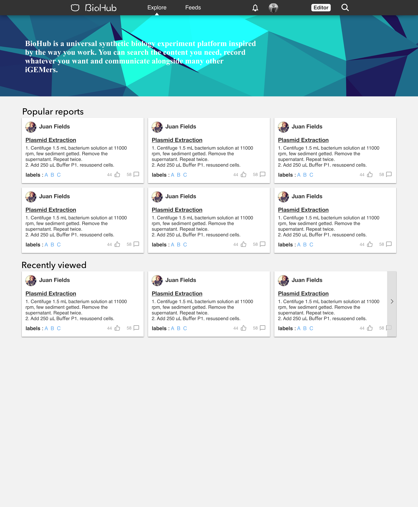

## 登录页

**需求**
- 左手挥动
- 超链接鼠标移上去颜色变化（可为插件默认效果）

**待改进**
- 输入密码错误提示incorrect password 
- 用户名不存在incorrect username

## 注册页

**需求**
- 移到button上会有颜色变化（可为插件默认效果）
  
**待改进**
- Uername错误输入框后面出现警告图标，Ｕsername变红，出现提示语句（Username exists）
- Email错误输入框后面出现警告图标，Email变红，出现提示语句（incorrect email）
- password输入过程中下方有强度提醒.(有插件可以用就先直接用.没有美工再画素材)
- password输入错误输入框出现警告图标.　password变红,出现提示语句(at least 8 characters)
- 巨幕相应的伸缩变长
- 可找到类似插件改进左侧多边形图，让图运动

## 忘记密码

**需求**
- Email错误输入框后面出现警告图标，Email变红，出现提示语句（incorrect email）
- 熊猫挥手

## 个人中心
#### 别人看到的个人中心：
**需求**

>此页面中头像下方的Reports,Following,Followers,Praises和右上角的Reports,Following,Followers,Praises点击效果等价.

默认：
Reports被选中，如下
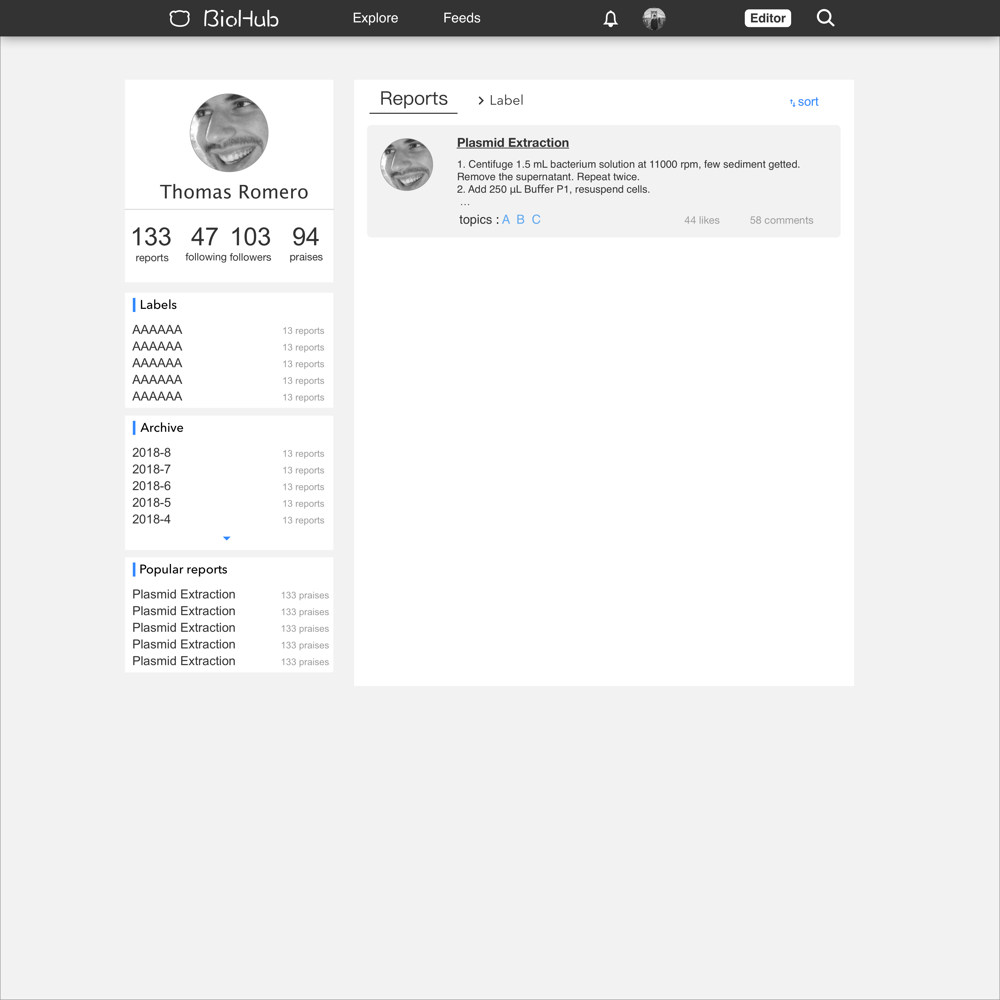
点击后：
- 点击右上角的Following,Followers,Praises标签，显示相应的信息（转换效果见下方说明）
- 在Following,Followers显示中能点击相应的profile进入其他用户的个人主页.显示follow或者unfollow选项.点击可以进行修改是否关注
- 如果Ａrchive或者Labels的內容大於5個，那麼需要顯示展開圖標.
- 点击Archive或者Archive中的标签，显示如下
- 点击Labels或者Lables中的标签，显示如下
- 点击Popular Reports中的内容跳转到报告显示页面

**转换效果**　
1. 如果此时显示了右上角的Following,Followers,Praises标签：
    1. 点击Archive和Labels时，Following,Followers,Praises渐影消失,相应的标签或者归档右侧快速插入出现
    2. 点击Following｜Followers｜Praises直接显示即可
2. 如果此时没有显示右上角的Following,Followers,Praises标签：
    1. 点击Archive和Labels及其相关内容时，直接显示即可
    2. 点击点击Following｜Followers｜Praises时，相应的标签或归档渐影消失,Following,Followers,Praises右侧快速插入出现

#### 自己看到的个人中心：
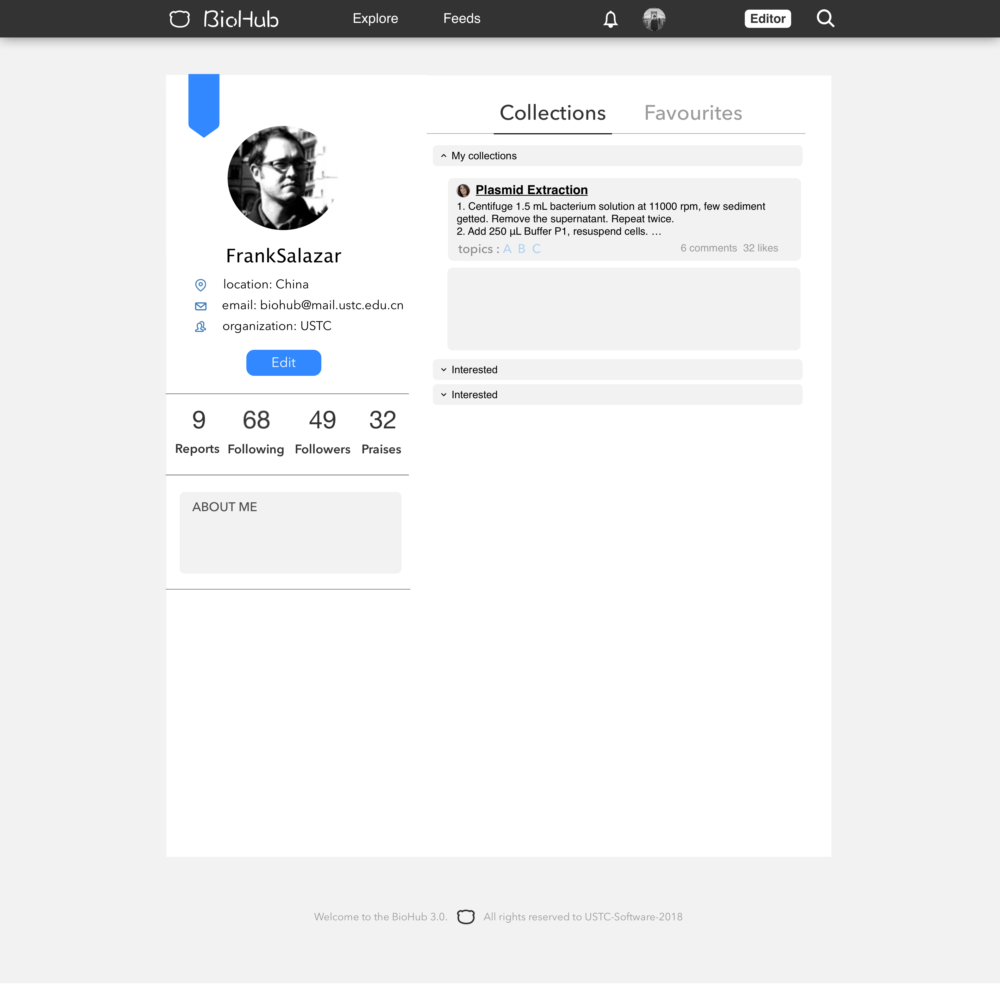
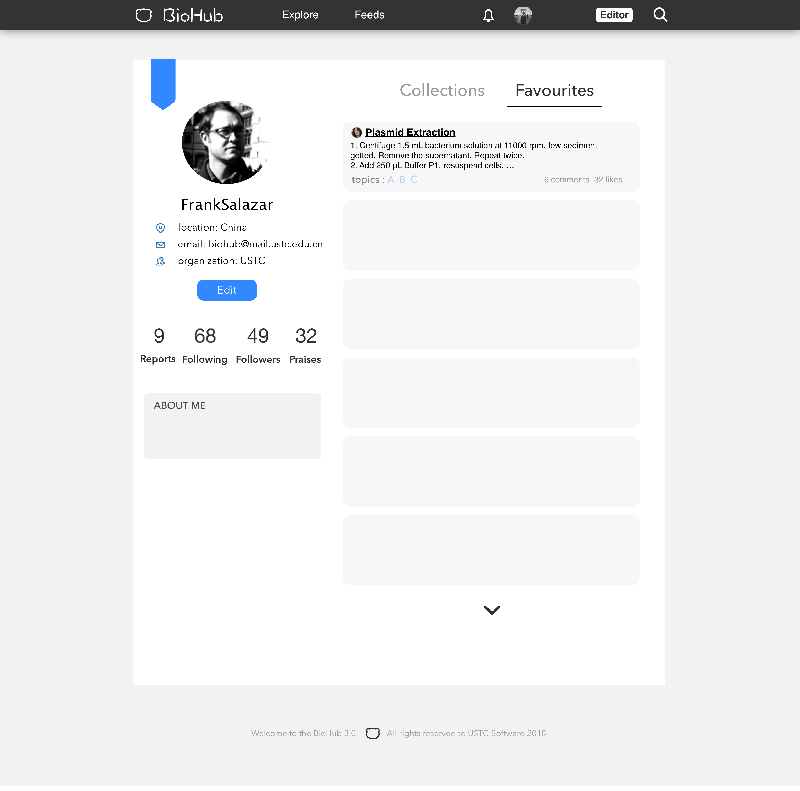
- 鼠标移到　**collections** 和　**favorites** 下方有选中的阴影线条
- 点击右上角 **collections** 和 **favorites** 显示自己的收藏和点赞文章
- 点击**collections**中的收藏夹分类可以收缩或展开收藏夹的内容
- 点击相应的　报告跳转到报告显示页面
- 点击edit跳转到修改信息页面
- 点击向下的小箭头显示下一组信息 collections | favorites 信息
- 点击Reports|Following|Followers|Praises|跳转到点击后的相应展示页（展示页中没有About Me,location,email,organization）

#### 修改个人信息页面
**需求:**
- 左侧目录Basic Information|Account|Reports鼠标指示有颜色变化
- 点击目录的内容显示相应的内容（点击Reports时，左侧目录向左收缩成一个可展开箭头）
- 点击箭头目录展开回来
- 修改信息不符合要求的（长度受限制，特殊字符等）save之后给出相应的错误提示样式
- 报告管理页中可以按照时间，标签，关键字筛选报告
- 可选择删除报告

**待改进：**
- 具体的错误提示
- 目录收缩的动画效果给出
- 添加管理标签在报告展示的右侧

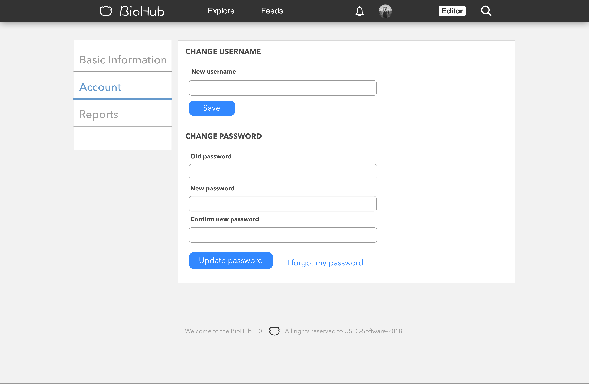
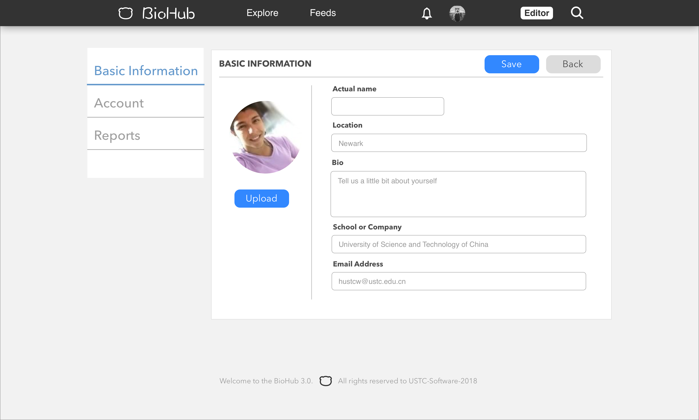
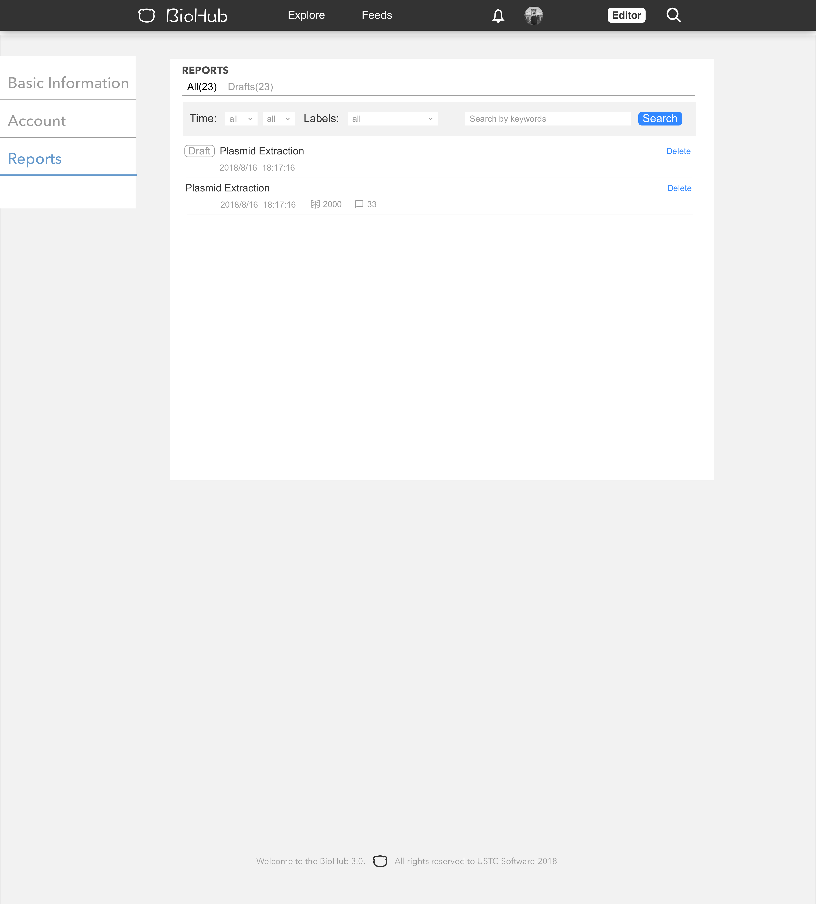
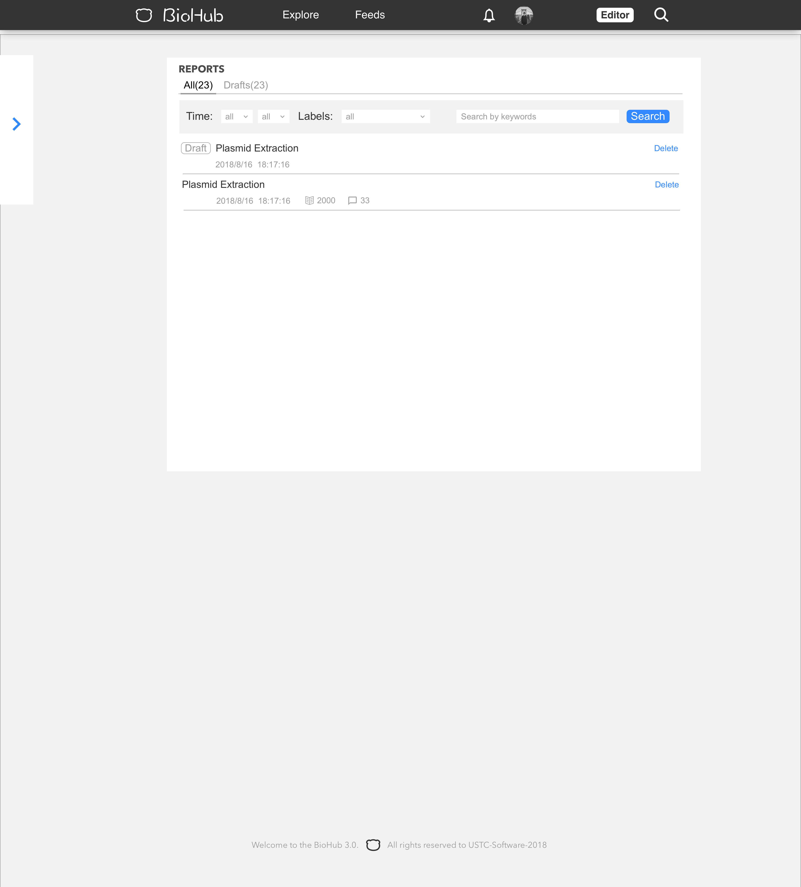

#### 搜索頁
**需求：**
- **默認**進入搜索框頁面
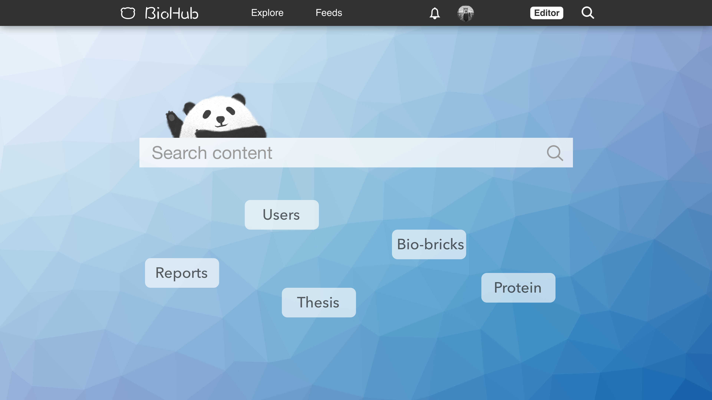
- 輸入完成回車，顯示智能搜索結果頁面
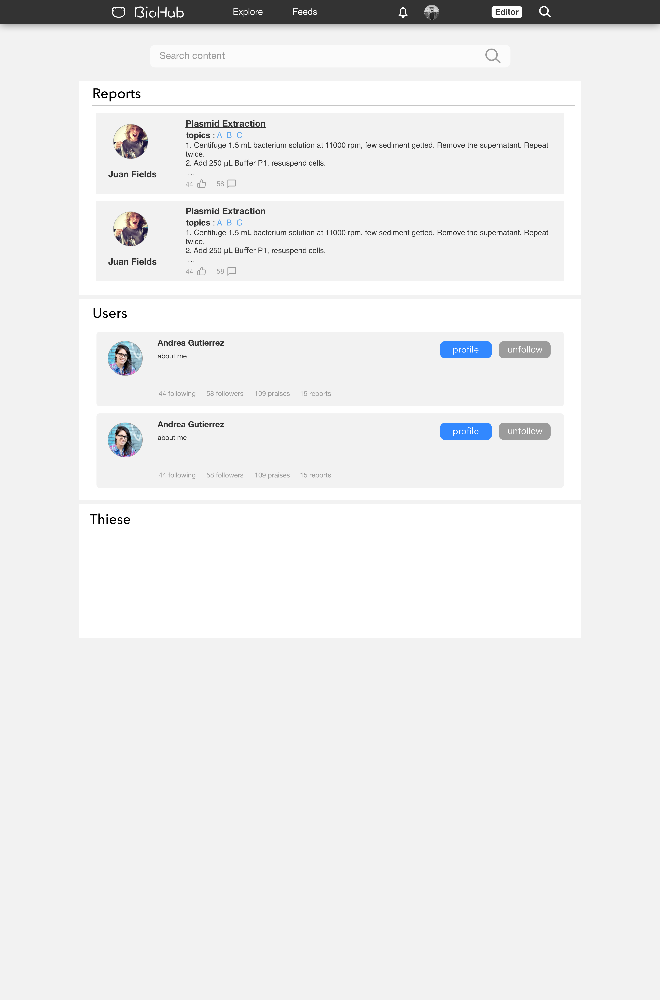
- 點擊一個搜索結果，顯示最終搜索頁面
- 最終搜索頁面上換lable可以切換搜索結果的搜索類型
- 點擊頂部已選中的搜索標籤可以選擇排序方式（標籤樣式可以選擇ＵＩ庫中已有的）
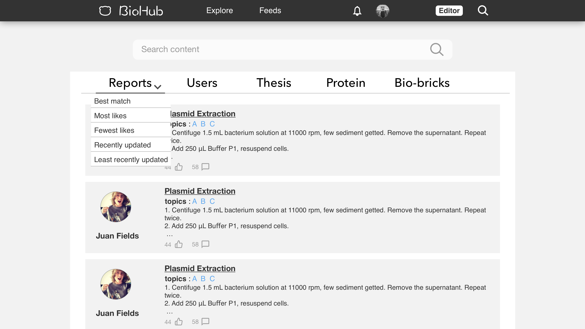

#### 消息提示页
**需求**
- 点击导航栏铃铛可进入
- 显示关注人的点赞
- 显示关注人关注的某人
- 显示关注人发布的新报告

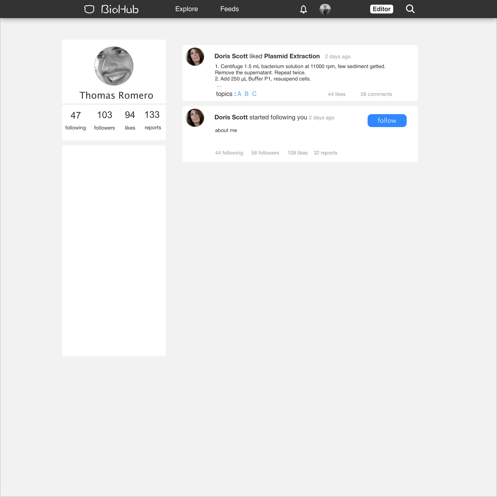

**待改进**
feeds页的作用？